  
    
  <a href="https://valentinmendez.vercel.app/#sobre-mi"><b>SOBRE MÍ</b></a> &nbsp;&nbsp;·&nbsp;&nbsp;
  <a href="https://valentinmendez.vercel.app/#proyectos"><b>PROYECTOS</b></a> &nbsp;&nbsp;·&nbsp;&nbsp;
  <a href="https://valentinmendez.vercel.app/#servicios"><b>SERVICIOS</b></a> &nbsp;&nbsp;·&nbsp;&nbsp;
  <a href="https://valentinmendez.vercel.app/#herramientas"><b>STACK</b></a>

 

Me enfoco en el diseño y desarrollo de **soluciones escalables** y en el análisis de datos, optimizando procesos del negocio mediante código limpio e insights estratégicos.

<table>
  <tr>
    <td width="50%" valign="top">
      <h3><a href="https://demo-barber.logabyte.com.ar/">Urban Barber</a></h3>
      <b><i>SaaS de turnos y pagos</i></b>
      
Gestión de turnos con cobros por Mercado Pago y notificaciones automáticas.

      
   

      <a href="https://demo-barber.logabyte.com.ar/"><b>Ver demo ↗</b></a>
    </td>
    <td width="50%" valign="top">
      <h3><a href="https://newsurfboard.logabyte.com.ar/">Gestión OK</a></h3>
      <b><i>SaaS de inventario</i></b>
      
Stock multivariante (talles y colores), proveedores, historial en tiempo real y catálogo online con pedidos por WhatsApp.

      
   

      <a href="https://newsurfboard.logabyte.com.ar/"><b>Ver demo ↗</b></a>
    </td>
  </tr>
  <tr>
    <td width="50%" valign="top">
      <h3><a href="https://lavadero-web.vercel.app/">Lavadero Web</a></h3>
      <b><i>SaaS gestor de servicios</i></b>
      
Reservas y flujo de trabajo automotriz con alertas personalizadas por email.

      
   

      <a href="https://lavadero-web.vercel.app/"><b>Ver demo ↗</b></a>
    </td>
    <td width="50%" valign="top">
      <h3><a href="https://foodie.logabyte.com.ar/">Gourmet</a></h3>
      <b><i>SaaS gestor de pedidos</i></b>
      
Pedidos para restaurantes con panel admin, pasarela de pagos, comandas impresas, control de stock y multi roles.

      
   

      <a href="https://foodie.logabyte.com.ar/"><b>Ver demo ↗</b></a>
    </td>
  </tr>
</table>

<table>
  <tr>
    <td width="33%" valign="top">
      <h4>Desarrollo de Software</h4>
      Aplicaciones web interactivas y escalables, con foco en la experiencia de usuario y el rendimiento.
    </td>
    <td width="33%" valign="top">
      <h4>Arquitectura &amp; Backend</h4>
      Bases de datos relacionales y servidores robustos que cuidan la integridad, velocidad y seguridad de tus datos.
    </td>
    <td width="33%" valign="top">
      <h4>Análisis de Datos &amp; BI</h4>
      Modelado, pipelines ETL y dashboards dinámicos para decidir con datos y no con intuición.
    </td>
  </tr>
</table>

  <b>FRONTEND</b> 
  

  <b>BACKEND Y BASES DE DATOS</b> 
  

  <b>HERRAMIENTAS</b> 
  

¿Tenés una idea o un proceso para ordenar? Escribime y lo vemos.

 

<i>Diseñado y desarrollado por Valentín Méndez</i>

